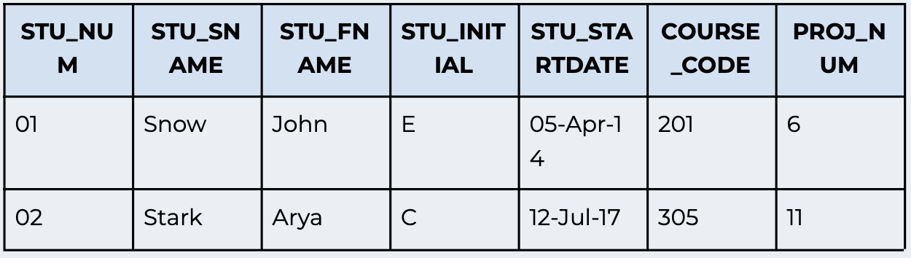
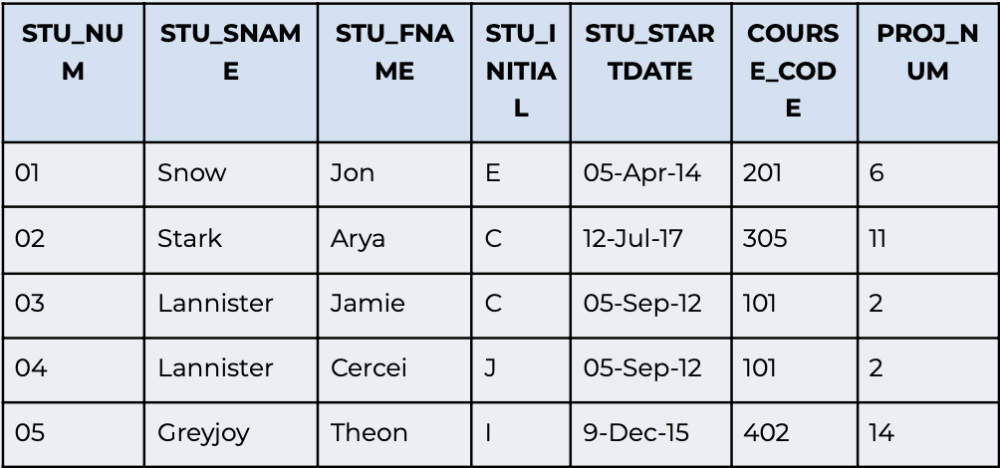
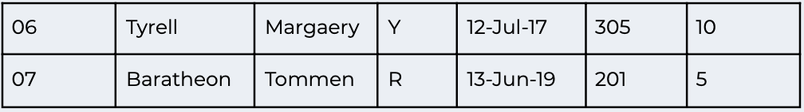

# SQL lab 

Answer the following questions:

1. Write the SQL code to create a table called Student. The table structure is summarised in the table below (Note that STU_NUM is the primary key):

2. After you have created the table in question 1, write the SQL code to enter the first two rows of the table as below:

3. Assuming all the data in the Student table has been entered as shown below, write the SQL code that will list all attributes for a COURSE_CODE of 305.

4.  Write the SQL code to change the course code to 304 for the person whose student number is 07.

5. Write the SQL code to delete the row of the person named Jamie Lannister, who started on 5 September 2012, whose course code is 101 and project number is 2. Use logical operators to include all of the information given in this problem.

6. Write the SQL code that will change the PROJ_NUM to 14 for all those students who started before 1 January 2016 and whose course code is at least 201.

7. Write the SQL code that will delete all of the data inside a table, but not the table itself.

8. Write the SQL code that will delete the Student table entirely.